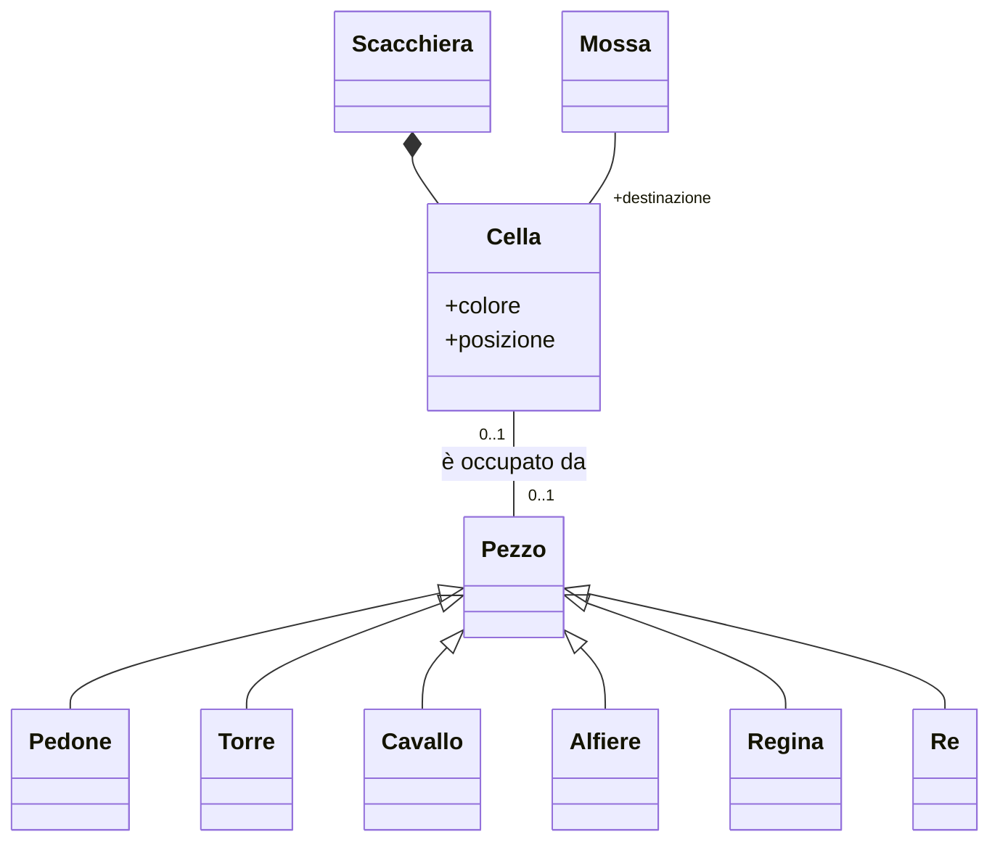

```mermaid
classDiagram
class Scacchiera
class Cella{
  +colore
  +posizione
}
Scacchiera *-- Cella
Cella "0..1" -- "0..1" Pezzo : è occupato da
Pezzo <|-- Pedone
Pezzo <|-- Torre
Pezzo <|-- Cavallo
Pezzo <|-- Alfiere
Pezzo <|-- Regina
Pezzo <|-- Re
Mossa -- "+destinazione" Cella
```
